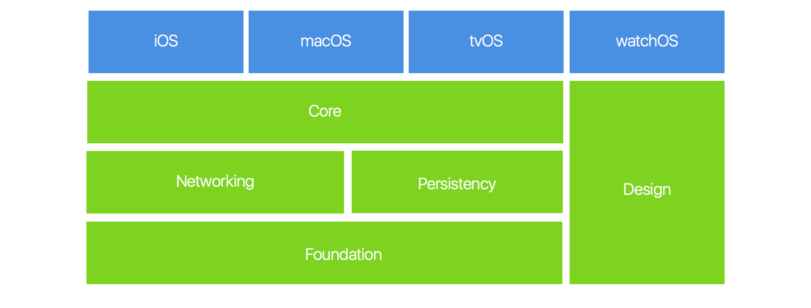
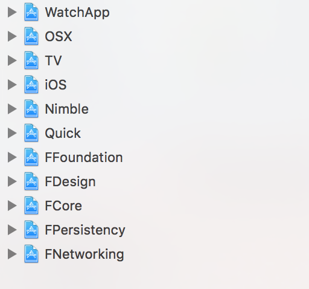
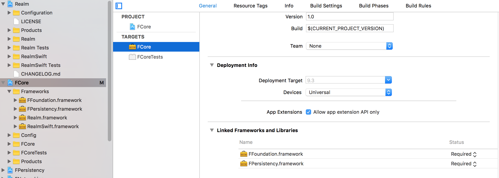

# Framework Oriented _Programming_
#### **Pedro Piñera @pepibumur**
# :watch::iphone::computer::tv:

---

## About Me
- **iOS Developer at SoundCloud**
- Email: [pepibumur@gmail.com](mailto://pepibumur@gmail.com)
- GitHub: [github.com/pepibumur](https://github.com/pepibumur)
- Twitter: [twitter.com/pepibumur](https://twitter.com/pepibumur)
<br>
- Open Source Project: [**SugarRecord**](https://github.com/pepibumur/sugarrecord)
<br>
>  Mention me with your cool :camera:


---

# __Framework__ Oriented Programming
- Started reference with [**GitDo**](https://gitdo.io)
- Applying principles to [**SoundClound**](https://soundcloud.com)
- Ideas/Principles together **(Reference)**

---

# Index

- Context
- Motivation
- Principles
- Open Questions
- How to?
- Conclusions

---

# Index

- **Context**
- Motivation
- Principles
- Open Questions
- How to?
- Conclusions

---

# Context

#### **Before 2008**
## OSX == **1 Bundle***
#### *_Xcode project target_

---

# Context

#### **2008**
## Apple launches iPhone OSX Software Development Kit :iphone:
#### _(Developers move to iOS. New platform, frameworks,... New exciting area)_

---

# Context
#### **After 2008**
## iOS == **1 Bundle***
## OSX == **1 Bundle***
#### *_Xcode project target_

---

## 2011


---

# Context
#### **2011**
## CocoaPods released
#### *Dependency Resolving + Integration + Community :tada:*

---

# Context
#### **After 2011**
## iOS == **1 Bundle***
## OSX == **1 Bundle***
## X Bundles (External Dependencies)
#### *_Xcode project target_

---

# Context
#### **2015**

# :watch: :tv:

---

# OMG
#### **That's awesome**


---

### **When your manager said**
## _"We have plans to launch the company app for these platforms"_


---
## Trying to __reuse__
### your code base
# :cold_sweat:


---

# Context
#### **2015**
## iOS == **1 Bundle***
## OSX == **1 Bundle***
## tvOS == **1 Bundle***
## watchOS == **1 Bundle***

---

# How to reuse code?
### _(across platforms)_

## **Frameworks**

---

# Swift :heart:
## **Dynamic Frameworks**
#### (OSX, iOS, watchOS, tvOS)

- Allow embedded resources *(images, fonts, ...)*
- Dynamically linked *(No duplicated symbols)*
- Swift & Objective-C code

---

# Framework Oriented Programming
### **Coding your apps organizing your code base in reusable & multiplatform code bundles**

Best Practices, Principles, Advices..

---

# Index

- Context
- **Motivation** 😋
- Principles
- Open Questions
- How to?
- Conclusions

---

# Multiplatform apps
## **Only working on the UI**
## :watch::iphone::tv::computer:

---

# New products
## **With similar core needs**
### *Because you want to reuse code, right?*

---

# Open Source
## **And benefit from the community**
### *Build pieces of code that you'd be proud of open sourcing*

---

# Specialized teams
## **From UI lovers to Core Data experts**
### _(clearly defined team boundaries)_

---

# Example *GitDo/SoundCloud*



---

# Index

- Context
- Motivation
- **Principles**
- Open Questions
- How to?
- Conclusions

---

# Principles
## __Let's dive into the theory__
### _(if you have better names, :bell: me)_

---

# 1. Single Responsibility
## __SOLID inspired__


---

# 2. Vertical dependencies
## __(Over Horizontal)__


---

# 3. __Lower__ in the stack
## __Fewer__ dependencies


---

# 4. __One Step__ Dependencies


---

# 5. __Internal__ by default


---

# 6. Final
//TODO - image

---

# 7. Framework _models_


---

# 8. Platform __Abstraction__


---

# 9. __Protocol__ Oriented Interfaces


---

# 10. Foundation

---

# Index

- Context
- Motivation
- Principles
- **Open Questions**
- How to?
- Conclusions

---

# Open Questions
## **External Dependencies?**
**RECOMMENDATION :warning:**

- `carthage checkout` for Framework Dependencies
- `pod install` for app Dependencies
- You can also use Git Submodules

---

# Open Questions
## **Versioning? Git repo per framework?**

**RECOMMENDATION :warning:**
- Keep it in the same repository *(fast iterations)*
- Move it once it consolidates. *(sporadic changes)*
- Then version it! *(snapshots in time)*

---

# Open Questions
## **Static or Dynamic?**

**RECOMMENDATION :warning:**
- `Objective-C` & not shared ~> **Static**
- `Objective-C` && shared ~> **Dynamic**
- `Swift` && `.*` ~> **Dynamic**

> The more dynamic the worse load time

---

# Index

- Context
- Motivation
- Principles
- Open Questions
- **How to?**
- Conclusions

---

# How to?
### **In only 5 steps**

---

# How to?
## **1. Project to Workspace**
### *(It can be the one created by CocoaPods)*


---

# How to?
## **2. Each Framework as a project in the workspace**
### *(You can create them as iOS Frameworks)*



---

# How to?
## **3. Use a `.xcconfig` file**
### *(and make them multiplatform)*

```
SUPPORTED_PLATFORMS = iphoneos iphonesimulator appletvsimulator appletvos macosx watchsimulator watchos
VALID_ARCHS[sdk=iphone*] = arm64 armv7 armv7s
VALID_ARCHS[sdk=macosx*] = x86_64
```


---

# How to?
## **3. Link them**
### *(Linked Frameworks and Libraries)*



---

# How to?
## **4. Update Location**
### *(Relative to Build Products)*


---

# How to?
## **5. Build/Test/Run**
### *Don't forget about running tests for your Frameworks on CI*
### *(And sharing the schemes of the frameworks)*
---

# Index

- Context
- Motivation
- Principles
- Open Questions
- How to?
- **Conclusions**

---

# Conclusions
//TODO

---

# References

- [**Library Oriented Programming**: Justin Spahr-Summers](https://realm.io/news/justin-spahr-summers-library-oriented-programming/)
- [**The Unofficial Guide to xcconfig files**](https://pewpewthespells.com/blog/xcconfig_guide.html)
