# Framework Oriented _Programming_
#### **Pedro Piñera @pepibumur**
# :watch::iphone::computer::tv:

---

# __Hello__
## _It's me_
### _(From ~~the other side~~ London)_


---

## About Me
- **iOS Developer at SoundCloud**
- Email: [pepibumur@gmail.com](mailto://pepibumur@gmail.com)
- GitHub: [github.com/pepibumur](https://github.com/pepibumur)
- Twitter: [twitter.com/pepibumur](https://twitter.com/pepibumur)
<br>
- Open Source Project: [**SugarRecord**](https://github.com/pepibumur/sugarrecord)
<br>
>  Mention me with your cool :camera:


---

# __Framework__ Oriented Programming
- Started with [**GitDo**](https://gitdo.io)
- Applying principles to [**SoundClound**](https://soundcloud.com)
- Ideas/Principles together **(Reference)**
- **Feedback** is welcome :grinning:

---

# Index

- Context
- Principles
- Advantages
- How to?
- Open Questions
- SoundCloud attempt
- Downsides
- Conclusions

---

# Index

- **Context**
- Principles
- Advantages
- How to?
- Open Questions
- SoundCloud attempt
- Downsides
- Conclusions

---

# Context

#### **Before 2008**
## OSX == **1 Bundle***
#### *_Xcode project target_

---

# Context

#### **2008**
## Apple launches iPhone OSX Software Development Kit :iphone:
#### _(Developers move to iOS. New platform, frameworks,... New exciting area)_

---

# Context
#### **After 2008**
## iOS == **1 Bundle***
## OSX == **1 Bundle***
#### *_Xcode project target_

---

## 2011


---

# Context
#### **2011**
## CocoaPods released
#### *Dependency Resolving + Integration + Community :tada:*

---

# Context
#### **After 2011**
## iOS == **1 Bundle***
## OSX == **1 Bundle***
## X Bundles (External Dependencies)
#### *_Xcode project target_

---

# Context
#### **2015**

# :watch: :tv:

---

# OMG
#### **That's awesome**


---

### **When your manager said**
## _"We have plans to launch the company app for these platforms"_


---
## Trying to __reuse__
### your code base
# :cold_sweat:


---

# Context
#### **2015**
## iOS == **1 Bundle***
## OSX == **1 Bundle***
## tvOS == **1 Bundle***
## watchOS == **1 Bundle***

---

# How to reuse code?
### _(across platforms)_

## **Frameworks**

---

# Swift :heart:
## **Dynamic Frameworks**
#### (OSX, iOS, watchOS, tvOS)

- Allow embedded resources *(images, fonts, ...)*
- Dynamically linked *(No duplicated symbols)*
- Swift code

---

# Framework Oriented Programming
### **Coding your apps organizing your code base in reusable & multiplatform code bundles**

Best Practices, Principles, Advices..

[github.com/pepibumur/framework-oriented-programming](https://github.com/pepibumur/framework-oriented-programming)

---

# Index

- Context
- **Principles**
- Advantages
- How to?
- Open Questions
- SoundCloud attempt
- Downsides
- Conclusions

---

# Frameworks Stack


---

# Principles
## __Let's dive into the theory__
### _(if you have better names, :bell: me)_

---

# 1. Single Responsibility
## __SOLID inspired__


---

# 1. Single Responsibility
## __SOLID inspired__


---

# Responsibility?
### __CoreData access layer?__


---

# Responsibility?
### __CoreData access layer?__
### __Storage access layer?__


---

# Responsibility?
### __CoreData access layer?__
### __Storage access layer?__
### __Keychain access layer?__


---

# Responsibility?
### __CoreData access layer?__
### __Storage access layer?__
### __Keychain access layer?__


---

# Responsibility?
### __CoreData access layer?__
### __Storage access layer?__
### __Keychain access layer?__
### __Models?__


---

# Responsibility?
### __CoreData access layer?__
### __Storage access layer?__
### __Keychain access layer?__
### __Models?__
# 😩


---

# 1. Single Responsibility
## __Start from a high level__


---

# 1. Single Responsibility
## __Slice them progressively__


---

# 1. Single Responsibility
## __Slice them progressively__
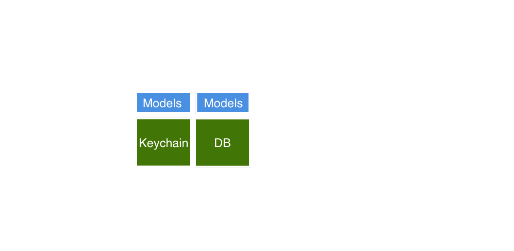

---

# 2. Vertical dependencies
## __(Over Horizontal)__
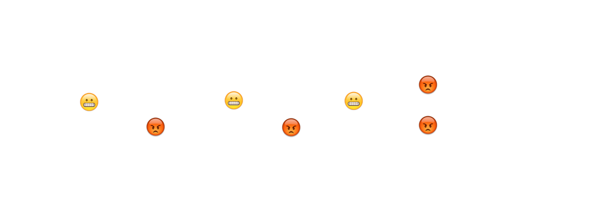

^ We want to have more cohesion between layers avoiding coupling between elements in the same layer.

---

# 3. __Lower__ in the stack
## __Fewer__ external dependencies


^Dependencies of lower frameworks and are also dependencies of upper frameworks

---

# 4. __One Step__ Dependencies


^ Frameworks should depend only on the frameworks below them.

---

# 4. __One Step__ Dependencies


^ This would make replacement easier and the frameworks less coupled.
^ Restrict the elements that are publicly exposed to other frameworks.
^ Define the scope of your framework and expose only that scope.

---

# 5. __Internal__ by default


^Swift makes it easier since internal is the default visibility.

---

# 6. Final
## __SOLID inspired (open/closed)__

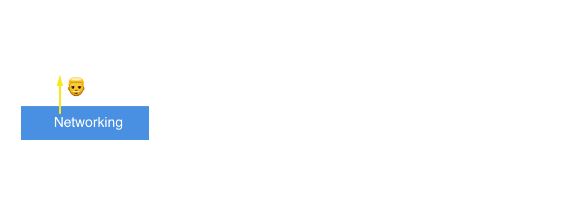

^ It's based in the open/closed principle of SOLID.
^ Allow extension (open) but without modifying the implementation.

---

# 6. Final
## __SOLID inspired (open/closed)__

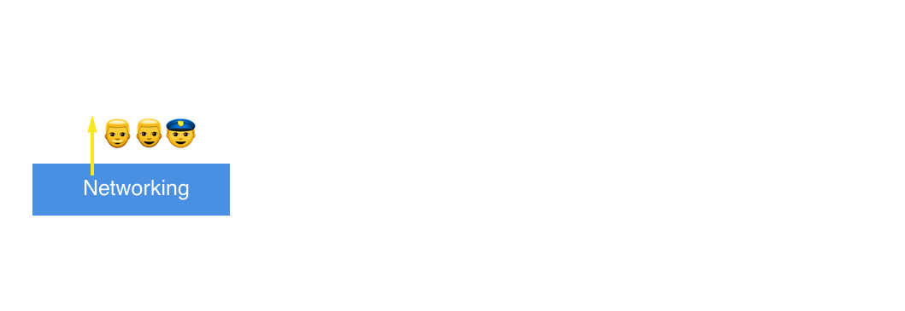

---

# 6. Final
## __SOLID inspired (open/closed)__

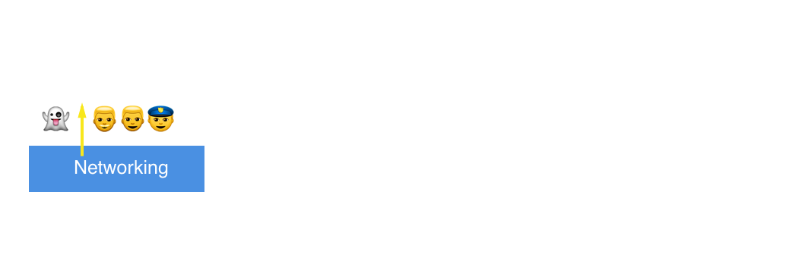

---

# 6. Final
## __SOLID inspired (open/closed)__

```swift
final class Person {
  let name: String
}

class Alien: Person { // Compiler complains
}
```

---

# 7. Framework __models__
### __Don't share lower frameworks models upwards__


---


# 7. Framework __models__
### __Don't share lower frameworks models upwards__

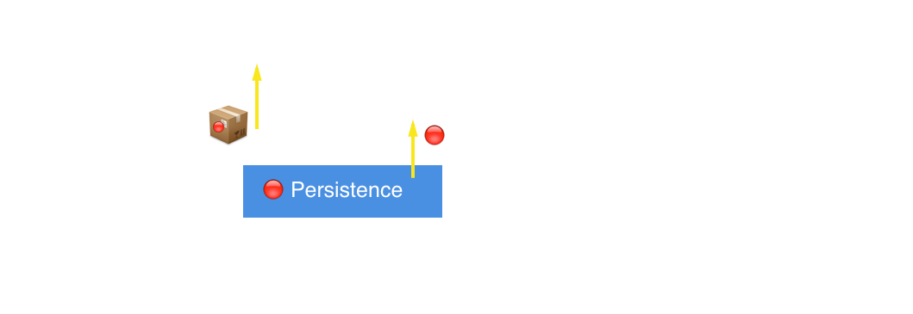

---

# 7. Framework __models__
### __Don't share lower frameworks models upwards__

```swift
// Persistence
class Author: NSManagedObjectModel {
  let name: String
}
class Track: NSManagedObjectModel {
  let author: Author
}

// ListenersKit
struct StreamTrackEntity {
  let name: String
  let authorName: String
}
```

---

# 7. Framework __models__
### __Don't share lower frameworks models upwards__

```swift
struct StreamTrackEntityAdapter {
  func adapt(track: Track) -> StreamTrackEntity {
    return StreamTrackEntity(name: track.name, authorName: track.author.name)
  }
}
```

---

# 8. Platform __Abstraction__
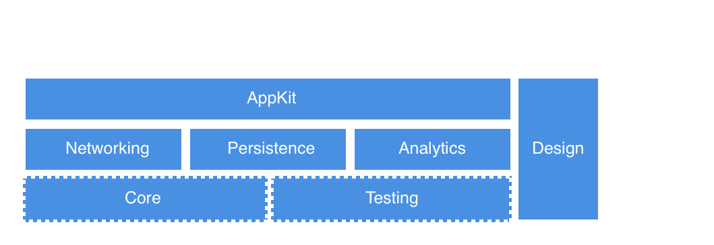

---

# __But...__
### _There's platform specific logic_
__Examples__
<br>
- No `NSFetchedResultsController` in macOS
- `NSIndexPath` is slightly different for watchOS.


---

# 8. Platform __Abstraction__
## __Macros!__

```swift
#if os(OSX)
  // OSX logic
#else
  // Other platforms logic
#endif
```

---

# 9. __Protocol__ Oriented Interfaces
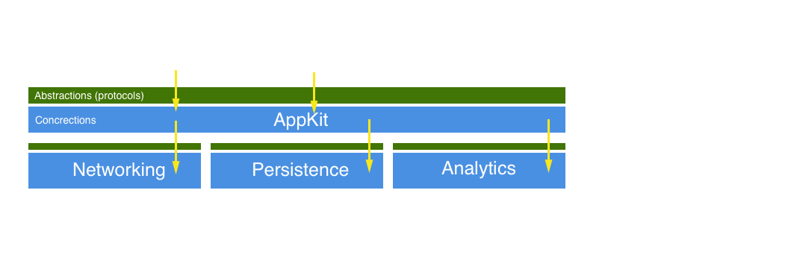

---

# 9. __Protocol__ Oriented Interfaces


---

# 9. __Protocol__ Oriented Interfaces


---

# 9. __Protocol__ Oriented Interfaces
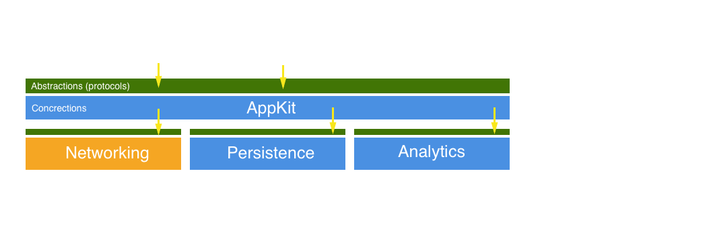

---

# 9. __Protocol__ Oriented Interfaces


---

# 10. Core/Testing
### __(aka your project Foundation frameworks)__


---

# 10. Core/Testing
### __Accessible from all the Frameworks__

- Extensions
- Logging
- Analytics
- Architectural components (e.g. Reactive)

---

# Index

- Context
- Principles
- **Advantages** 😋
- How to?
- Open Questions
- SoundCloud attempt
- Downsides
- Conclusions

---

# Multiplatform apps
## **Only working on the UI**
## :watch::iphone::tv::computer:


---

# Multiplatform apps
## **Only working on the UI**
## :watch::iphone::tv::computer:


---

# Experimentation
## **`import MyAppKit`**

- Prototyping
- Playgrounds

---

# Experimentation

```swift
// Playground
import SoundCloudKit

SoundCloud.search(term: "acdc").subscribeNext { tracks in
  print(track.name)
}
```

---

# New products
## **With similar core needs**
### *Because you want to reuse code, right?*

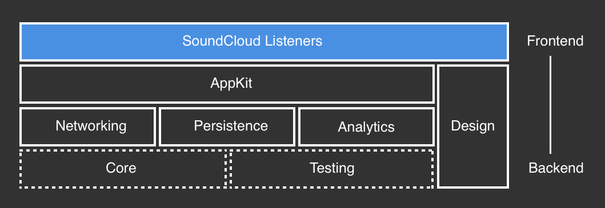

---

# New products
## **With similar core needs**
### *Because you want to reuse code, right?*


---

# Open Source
## **And benefit from the community**
### *Build pieces of code that you'd be proud of open sourcing*

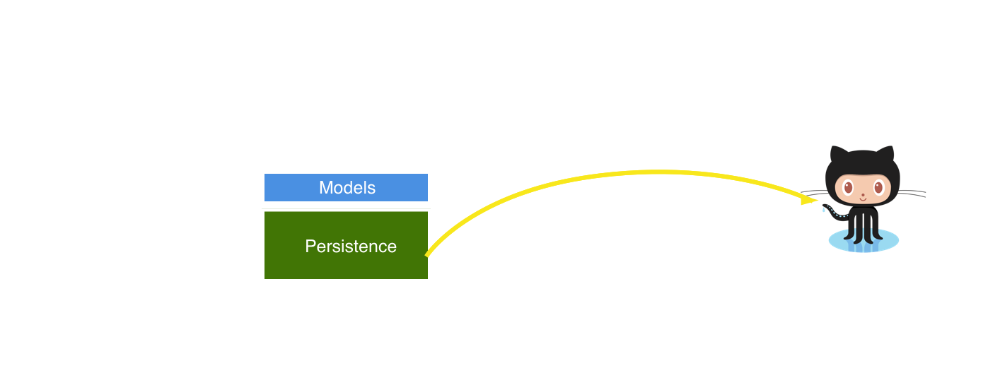

---

# Specialized teams
## **From UI lovers to Core Data experts**
### _(clearly defined team boundaries)_


---

# Specialized teams
## **From UI lovers to Core Data experts**
### _(clearly defined team boundaries)_


---


# Index

- Context
- Principles
- Advantages
- **How to?**
- Open Questions
- SoundCloud attempt
- Downsides
- Conclusions

---

# How to?
### **There are multiple options**
#### _(I'll show you some)_

---

# How to?
### **CocoaPods**


---

# How to?
### **CocoaPods**

- ✅ Easy setup (each Framework `.podspec`)
- ✅ You don't have to worry about Xcode Frameworks configuration
- ✅ Same setup for local/external dependencies
- ❌ `.podspec` cannot point to another local `.podspec`s
- ❌ CocoaPods sucks if you don't version.

---

# How to?
### **Local podspec discovery**

```ruby
# Networking ~> Core dependency not found
pod 'Networking'
pod 'Core'
pod 'AppKit'
```

---

# How to?
### **Local podspec discovery**

```ruby
pod 'Core'
pod 'Networking' # Core has already been resolved
pod 'AppKit'
```

---

# How to?
### **Manual**

- ✅ More control over the workspace
- ❌ Cumbersome setup *(Build Settings)*
- External dependencies can be checked out with Carthage/Git Submodules.

---

# How to?
### **Hybrid**

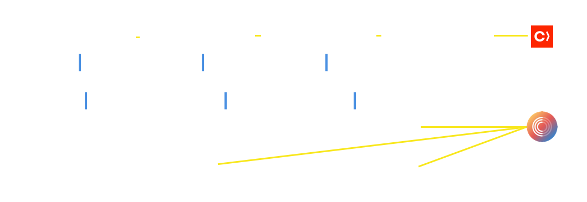

---

# Index

- Context
- Principles
- Advantages
- How to?
- **Open Questions**
- SoundCloud attempt
- Downsides
- Conclusions

---

# Open Questions
## **External Dependencies?**
**RECOMMENDATION :warning:**

- __If CocoaPods for local:__ Use it also for external.
- __If manual setup:__ Use Carthage for checking out external dependencies `carthage update`
  - With the binary.
  - Adding the project to the workspace: `--no-build`

---

# Open Questions
## **Versioning? Git repo per framework?**

**RECOMMENDATION :warning:**
1. Keep it in the same repository *(fast iterations)*
2. Move it once it consolidates. *(sporadic changes)*
3. Then version it! *(snapshots in time)*

---

# Open Questions
## **Static or Dynamic?**

**RECOMMENDATION :warning:**
- `Objective-C` & not shared ~> **Static**
- `Objective-C` && shared ~> **Dynamic**
- `Swift` && `.*` ~> **Dynamic**

> The more dynamic the worse load time

---

# Open Questions
## **Migrate existing project**

**RECOMMENDATION :warning:**
- Start with `Core/Testing`
- Move `Foundation` components down.
- Continue building layers progressively.

*You'll figure out how couple your code is 😂*

---

# Index

- Context
- Principles
- Advantages
- How to?
- Open Questions
- **SoundCloud attempt**
- Downsides
- Conclusions

---

# We **failed** at our first try
## Why?

---

# 1. We did setup with **CocoaPods**
*I'm not against CocoaPods!*

Local Pods + No versioning + Team = `It Sucks`

---

# 2. __Too many__ frameworks

- No clear responsibilities
- Crossed dependencies
- Messy dependency tree
- Very small responsibilities

---

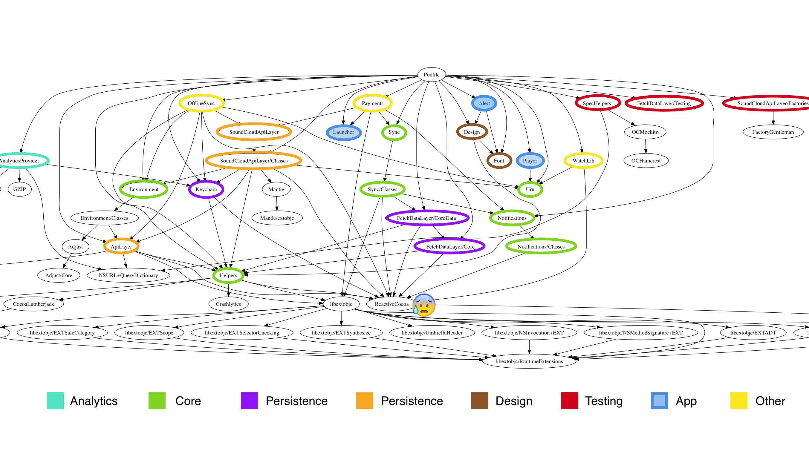

---

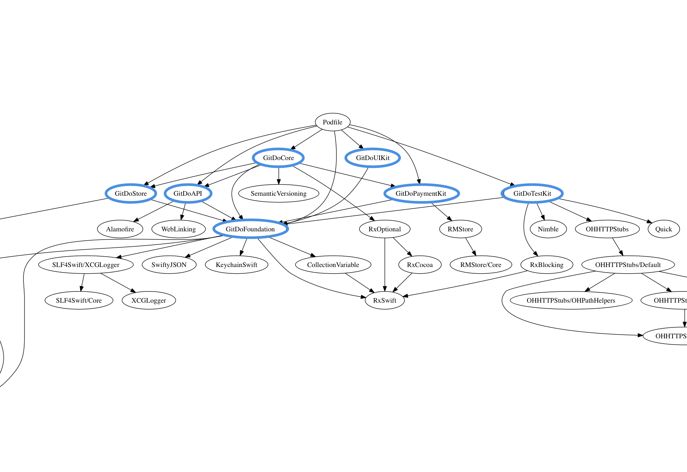

---

# Index

- Context
- Principles
- Advantages
- How to?
- Open Questions
- SoundCloud attempt
- **Downsides**
- Conclusions

---

# Lack of documentation
### __Tip: Use CocoaPods and copy the configuration__

---

# Storyboards/Xibs in Frameworks
# __Sucks 😥__
### __Tip 1: Keep them in the application target__
### __Tip 2: Reuse UI only if it's in code__

---

# Frameworks code recognition
# __Sucks even more 😭__

---

# Index

- Context
- Principles
- Advantages
- How to?
- Open Questions
- SoundCloud attempt
- Downsides
- **Conclusions**

---

# **Very time-saver**
## for multi-platform projects

---

#  Helps with **less coupled** code
### *(defined boundaries)*

---

# Setup requires some
## **Xcode Build Settings knowledge**
### *Unless you use CocoaPods*

---

# **Minimize** external dependencies (KISS)
### _(avoid more than 2 levels)_

---

# Use your **commonsense**
## _When deciding the Frameworks you need_
### _(don't get inspired from Javascript)_

---

# **Configuration** depends on your project
- New project?
- Existing project to migrate?
- Many external dependencies?
- Not that many?
- Already using CocoaPods?

---

# __References__

- [**Library Oriented Programming**: Justin Spahr-Summers](https://realm.io/news/justin-spahr-summers-library-oriented-programming/)
- [**The Unofficial Guide to xcconfig files**](https://pewpewthespells.com/blog/xcconfig_guide.html)
- [**CocoaPods**](https://cocoapods.org)
- [**Carthage**](https://github.com/carthage)
- [**pepibumur/framework-oriented-programming**](https://github.com/pepibumur/framework-oriented-programming)
- [**Static & Dynamic libraries**](https://pewpewthespells.com/blog/static_and_dynamic_libraries.html)
- [**Creating your first iOS Framework**](https://github.com/pepibumur/framework-oriented-programming)

---


----

# Questions? :grinning:

[SpeakerDeck Slides: http://bit.ly/22m4lwi](http://bit.ly/22m4lwi)
